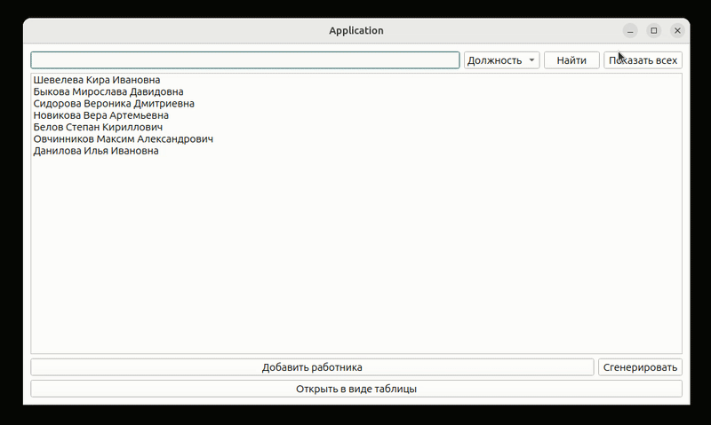

 

###

  

###

<h3 align="left">👩‍💻  Обо мне</h3>

Меня вдохновляет системное программирование и разработка высокоэффективного ПО на <strong>C/C++</strong>. Именно в этой области я хочу развиваться профессионально и строить карьеру.
 
<ul> 
  <li><strong>1 год коммерческого опыта</strong> в компании <strong><a href="https://eidos-robotics.ru/"> Eidos Robotics</a></strong> на позиции младшего инженер-программиста С++/Python</li>
  <li>Заканчиваю обучение в <string>школе 21</string> по разработческой специальности на C/C++</li>
  <li>Хорошо владею <strong>C/C++</strong>, включая <code>STL</code>, современные стандарты <code>C++11/14/17</code>, основы многопоточности, RAII и умные указатели</li>
  <li>Есть практический опыт в написании <strong>сетевых приложений</strong> на C/C++ (сокеты, TCP/UDP)</li>
  <li>Свободно ориентируюсь в <strong>Linux</strong>, использую его как основную операционную систему для работы и разработки</li>
  <li>Опытный пользователь <strong>Git</strong>: умею вести историю, работать с ветками, решать конфликты, писать понятные коммиты и организовывать командную работу</li>
  <li>Работаю с <strong>CMake</strong>, умею структурировать проекты и подключать библиотеки, в том числе через вложенные CMakeLists</li>
  <li>Имею опыт внедрения <strong>баз данных</strong> в приложения на C/C++ (в том числе через PostgreSQL)</li> 
</ul> 

Я открытый и гибкий в обучении, всегда готов осваивать новые инструменты, улучшать код и развивать техническое мышление. Люблю, когда код — это не только решение задачи, но и пример читаемости, устойчивости.

###

<h3 align="left">🧩 Проекты</h3>
<ul>
  <li>
    <strong>Десктопное приложение для управления персоналом (Qt/C++)</strong>
    <ul>
      <li>
        

          
Демонстрация работы приложения
 
          

            

              
            

          

        

      </li>
      <li>Основной функционал:
        <ul>
          <li>Добавление/редактирование/удаление сотрудников</li>
          <li>Поиск по ФИО, должности, стажу</li>
          <li>Увольнение с указанием причины</li>
        </ul>
      </li>
      <li>Технические особенности:
        <ul>
          <li>Сериализация данных через QDataStream</li>
          <li>Поддержка загрузки изображений</li>
          <li>Два режима отображения (список/таблица)</li>
        </ul>
      </li>
      <li>Стек технологий:
        <ul>
          <li>C++ (ООП, STL)</li>
          <li>Qt (QWidgets, сигналы/слоты)</li>
          <li>Кастомизированные виджеты</li>
        </ul>
      </li>
      <li>
        <a href="https://github.com/antonk-prog/employee-manager-qt">Ссылка на проект</a>
      </li>
    </ul>
  </li>
</ul>

<ul>
  <li>
    <strong>Роботизированный захват предметов с компьютерным зрением</strong>
    <ul>
      <li>
        

          
Демонстрация работы

          

            

              
            

          

        

      </li>
       <li>Основной функционал:
        <ul>
          <li>Распознавание и локализация объектов с использованием компьютерного зрения (OpenCV, YOLO)</li>
          <li>Интеграция с робототехническим API для управления манипулятором (Python, C++)</li>
          <li>Анализ 2D-изображений и расчёт оптимальных траекторий захвата</li>
        </ul>
      </li>
      <li>Технические особенности:
        <ul>
          <li>Алгоритмы точного позиционирования и управления захватом</li>
          <li>Инструменты калибровки камеры и привязки координатных систем</li>
          <li>Модуль тестирования точности системы и проверки стабильности работы</li>
        </ul>
      </li>
      <li>Стек технологий:
        <ul>
          <li>Python</li>
          <li>C++</li>
          <li>OpenCV</li>
          <li>Yolo</li>
          <li>Робототехническое API</li>
          <li>Scipy</li>
          <li>Numpy</li>
        </ul>
      </li>
      <li>
        

          
Подробное описание

          

            
 Программный комплекс предназначен для автоматизированного захвата предметов из контейнера с помощью камеры и набора интеллектуальных алгоритмов. Его основная задача — дать роботу «зрение» и способность действовать самостоятельно в условиях, где предметы лежат неупорядоченно. 
 
 Главный модуль системы объединяет сразу несколько компонентов: он получает изображение с камеры, с помощью технологий компьютерного зрения (OpenCV) и нейросетевого распознавания (Yolo) определяет положение нужных объектов, затем рассчитывает оптимальные траектории и передаёт команды на управление роботом через соответствующее API. Этот модуль фактически связывает «глаза» и «руки» машины, позволяя ей точно и надёжно выполнять задачи захвата. 
 
 Дополнительно в составе комплекса реализованы вспомогательные инструменты: утилита калибровки камеры, которая позволяет добиться высокой точности распознавания и соответствия координат, а также модуль проверки точности, с помощью которого можно убедиться, что система работает корректно и стабильно. Всё это делает комплекс универсальным решением для автоматизации на производстве или в робототехнических проектах. 

          

        

      </li>
    </ul>
  </li>
</ul>

###

<h3 align="left">🛠 Стек технологий:</h3>

###

  
  
  
  
  
    
  
  
  
  
  
  
  
  
  
  
  
  

