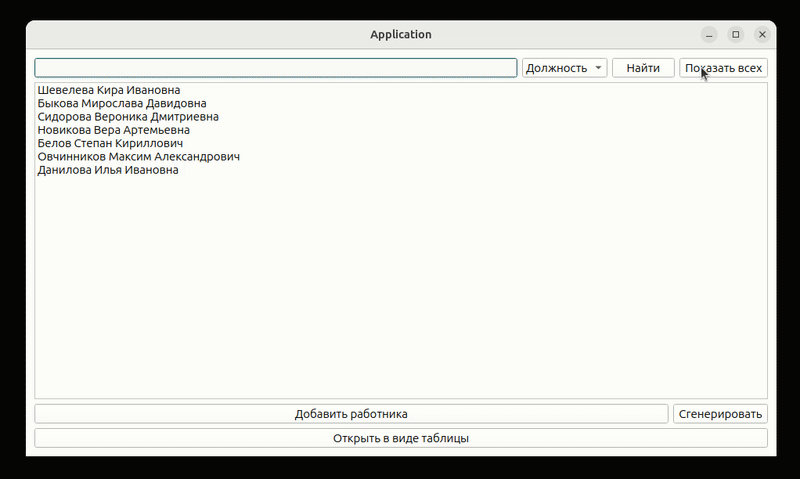

<h1 align="center">Привет! Я Антон 👋</h1>

  C/C++ разработчик, увлечённый системным программированием, робототехникой и эффективными архитектурными решениями. Добро пожаловать в мой GitHub!

  

  

---

## 👨‍💻 Обо мне

Меня вдохновляет системное программирование и создание эффективного ПО на **C/C++**.  
Вкратце обо мне:

- 🔧 **1 год коммерческого опыта** в [Eidos Robotics](https://eidos-robotics.ru/) (младший инженер-программист C++/Python)
- 🎓 Завершаю обучение в **Школе 21** (C/C++, системное программирование)
- 💡 Глубокое понимание **STL**, **RAII**, **C++11/14/17**, многопоточности и архитектурных паттернов
- 🌐 Опыт разработки **сетевых приложений** (TCP/UDP, сокеты)
- 🐧 Работаю в **Linux**, использую его как основную ОС
- 🛠 Владение **Git**, **CMake**, структурированием кода, CI
- 🗃 Знаком с **встраиванием PostgreSQL** в С/C++-приложения

> Открыт для интересных проектов, развития и командной работы. Люблю понятный и стабильный код, уважаю инженерный подход.

---

## 🧩 Проекты

### 📌 Десктопное приложение для управления персоналом (Qt/C++)

<table>
<tr>
<td width="60%">
<ul>
  <li><strong>CRUD-функционал</strong> для сотрудников: добавление, увольнение, редактирование</li>
  <li>Поиск по ФИО и должности, сериализация через QDataStream</li>
  <li>Собственная мини-БД, загрузка изображений, два режима отображения</li>
</ul>

**🛠 Стек:** C++, Qt (Widgets), STL, сигналы/слоты  
🔗 [Ссылка на проект](https://github.com/antonk-prog/employee-manager-qt)
</td>
<td>
  
</td>
</tr>
</table>

---

### 🤖 Роботизированный захват предметов с компьютерным зрением

<table>
<tr>
<td width="60%">
<ul>
  <li>Локализация объектов через OpenCV + YOLO</li>
  <li>Реализация траекторий захвата и управление манипулятором (C++, Python)</li>
  <li>Калибровка камеры и координатных систем</li>
</ul>

**🛠 Стек:** Python, C++, OpenCV, YOLO, SciPy, Numpy  
🔍 Подробнее:

Описание проекта

Комплекс распознаёт объекты в беспорядке, определяет координаты и даёт команды манипулятору для точного захвата. Использует нейросети, обработку изображений, API управления захватом, а также инструменты калибровки и тестирования точности.

</td>
<td>
  
</td>
</tr>
</table>

---

## 🛠 Навыки и стек

| Языки             | Инструменты                | Операционные системы |
|-------------------|-----------------------------|-----------------------|
| C, C++ (STL, RAII) | CMake, Qt, Git, Docker      | Linux (Ubuntu, Arch)  |
| Python             | PostgreSQL, OpenCV, YOLO    |                       |

  
  
  
  
  
  
  
  
  
  
  
  
  
  
  

---

## 📊 GitHub Статистика

  
  

---

## 📬 Чем могу быть полезен

- Разработка надёжного и производительного C/C++ кода
- Проектирование архитектур под реальное ПО и задачи
- Разработка приложений для Linux/Qt/сетей/робототехники

📫 [Связаться в Telegram](https://t.me/antonk_prog)

---
